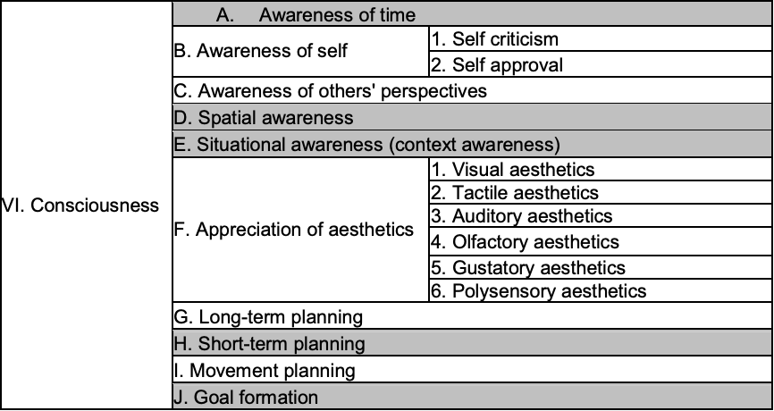

* [Index](index.md)
* [What Is It Like to Be Artificial Intelligence?](bat.md)
* [Phenomenology of Machine Perception](phenomenology-perception.md)
* [The Architecture of a Mind](synthetic-intelligence.md)

# The Architecture of a Mind

## Introduction
> Dörner’s theory has much in common with a number of cognitive architectures that have been developed at computer science departments, such as the Neural Theory of Language of Jerome Feldman’s group at Berkeley (Feldman 2006), Stan Franklin’s attempts at ‘Conscious Agents’ (2000), Aaron Sloman’s inspiring but not very detailed Cognition and Affect architecture (which in turn owes much to Antonio Damasio) (2001), and its reasoning components and methods of internal representation could be compared (even though the result will find many differences) to the psychological cognitive architectures.

[*Principles of Synthetic Intelligence*, Joscha Bach](http://cognitive-ai.com/publications/assets/Draft-MicroPsi-JBach-07-03-30.pdf#page=16)

## Blueprint of a Mind
Intentions are the selected motives. Combined with a method, they achieve a desired outcome. Notably, these intentions, according to Psi theory, aren't strictly limited to conscious and object-directed actions. A task can proceed without conscious attention. However, automatism may not be available. The process derives a course of action from rules. There's a need for analyzing the situation. Joscha Bach adapts strategies in cases where known strategies aren't applicable through a planning process to recompose behaviors. Automatism applies to machine intelligence development. I ponder how. Can machine intelligence possess intentions in a way similar to human motives? Can it adapt strategies or engage in planning processes autonomously? Bach examines the extent to which contemporary perceptual models capture AGI subjectivity. Dörner's "blueprint of a mind" prompts this. Inherent biases could constrain machine intelligence's action? Are they in these models? Is it feasible to abstract a "general" intelligence from human embodiment and cultural particularities? Or would the intelligence of a computer be fundamentally different yet no less sophisticated than that of a human brain? Epistemological considerations surrounding intelligence in synthetic systems. *Principles of Synthetic Intelligence* highlights them. Dörner emphasizes the feeling aspect of emotions. He asserts that it's the most important element, even though not every situation explicitly invokes the feeling perception. Typically only extreme changes in emotional configurations are remarkable enough to be consciously perceived. Notably, emotions can also be unconscious in current Psi agents. They're not endowed with language in Psi agents. Currently, Psi agents aren't conscious, with Dörner likening them to animals. However, Dörner envisions a future state where Psi agents. Abstract thinking, resembling an internal question/answer game, could autonomously acquire new schemas not just from environmental stimuli. Language is a tool that leads to a cognitive explosion. Dörner distinguishes *Psi sine lingua* and *Psi cum lingua*. Consciousness is heterogeneous with awareness, attention, readiness for action, wakefulness, and the degree of constitution of a concept of self by reflection. Dörner's blueprint of a mind introduces this. Existing Psi agents cover some aspects of this list, but the reflective processes aren't specified in enough detail and likely require language to function adequately. Language, according to Dörner, enables questioning current strategies. It constructs metastrategies and represents verbal thinking strategies in a way that is completely accessible, leading to conscious awareness of respective concepts through certain reflection levels.

## The Psi Theory
Functionalism challenges John Searle's view that consciousness is a causally emergent property tied to biological neurons. Epistemological grounds exist for functionalism's conceptual adequacy. This is a key concern in AGI research on whether it's possible to abstract a "general" intelligence from human embodiment and culture's particularities. How do contemporary perspectives in AGI address environmental coupling, sensory-motor interactions? How do comprehensive models inform artificial general intelligence? Emotion isn't presented as an independent subsystem. The Psi theory's approach impacts overall cognitive functioning. Language is syntactically organized symbols that designate conceptual representations, extending cognition.The Psi theory posits this. The Psi theory makes a clear distinction between emotion and motivation.

> [T]he motivational system determines *what* has to be done, emotions influence *how* it is being done.

[Hillel 1997](http://cognitive-ai.com/publications/assets/Draft-MicroPsi-JBach-07-03-30.pdf#page=85)

Debates in AGI regard affective state modeling. The Psi theory's separation relates to them. What are the implications for designing more human-like AGI? Bach likens emotions to colors and shapes inseparable from objects. Nuanced AI systems integrate emotional components. How can contemporary AGI models leverage the intertwinement of emotions with cognitive processes? Emotion is an internal phenomenology, a conjunction of specific forms of psychological processes. It reflects recent cognitive science research towards understanding emotions as integral to cognition rather than distinct modules. How can AGI models better capture emotion's internal phenomenology? The Psi theory conceives of emotions as a form of cognitive modulation, or behavior moderation. How can emotions inform self-regulating AGI system development?

[Consciousness](http://cognitive-ai.com/publications/assets/Draft-MicroPsi-JBach-07-03-30.pdf#page=237)

## Easy and Hard Problems of Consciousness
Cognitive processes are promoted based on the attention they require. Performance evaluation shouldn't be confused with awareness but is treated as a cognitive behavior or optimizing an AGI system's task performance. David Chalmers identifies "easy problems" in consciousness like discriminating stimuli and integrating information. These are actively being addressed in building AGI. Can a "general" intelligence be abstracted from human culture? Cognitive processes are promoted based on their needs. A certain level of specificity tied to the system's particularities queries human-like intelligence's transferability to machines and the extent to which the design choices made during AGI's development constrain or shape it. A machine's intelligence in considering the "hard problem" of consciousness may reach a sophisticated level.